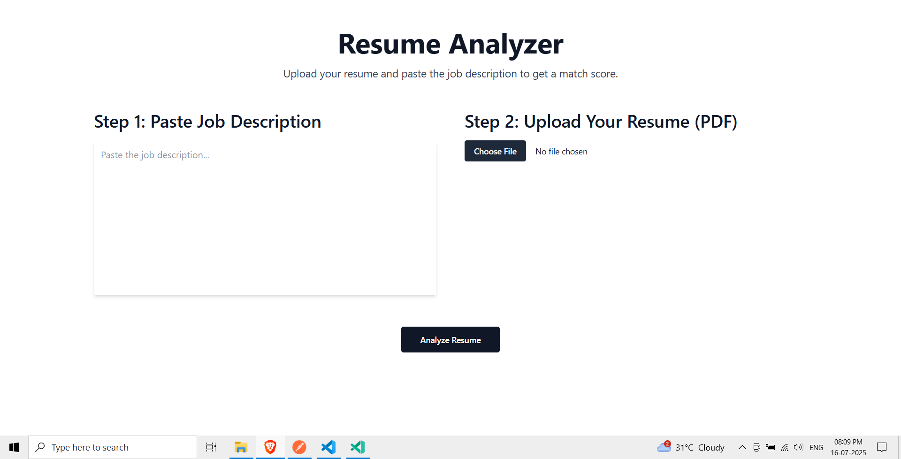
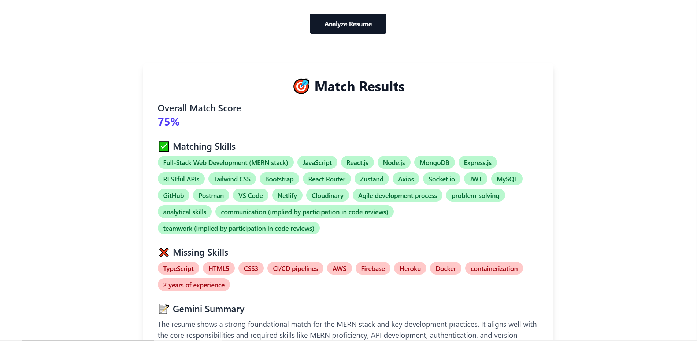

# 🧠 AI Resume Analyzer

An AI-powered web app that analyzes your resume against a job description using **Google Gemini Pro**, and returns a match score, skills analysis, and recommendations.

---

## 🔗 Live Demo

- 🌐 **Frontend** (Netlify): [Live App](https://resilient-boba-a20266.netlify.app/)
- 🛠️ **Backend** (Render): [API](https://ai-resume-backend-m4vu.onrender.com)

---

## 🚀 Features

- 📄 Upload your resume (PDF or DOCX)
- 📋 Paste a job description
- 🤖 Gemini AI analyzes and returns:
  - Compatibility score
  - Matched vs missing skills
  - Improvement suggestions

---

## ⚙️ Tech Stack

| Layer     | Tech Used                          |
|-----------|-------------------------------------|
| Frontend  | React, Tailwind CSS, Axios          |
| Backend   | Node.js, Express, Multer, pdf-parse |
| AI Engine | Google Gemini Pro API               |
| Hosting   | Netlify (Frontend), Render (Backend)|

---

## 🛠️ Installation Guide (Local Setup)

### ✅ Prerequisites

- Node.js v20+
- Git
- npm

---

### 📁 Clone the project

```bash
git clone https://github.com/your-username/ai-resume-analyzer.git
```

---

### 🔧 Backend Setup

```bash
cd backend
npm install
```

> Create a `.env` file in `/backend` and add your Gemini API key:

```env
GEMINI_API_KEY=your_api_key_here
```

Start the server:

```bash
npm start
```

It will run at: `http://localhost:3000`

---

### 💻 Frontend Setup

```bash
cd ../frontend
npm install
```

If using hardcoded backend URL (no `.env`), make sure it points to your hosted API.

Start frontend:

```bash
npm run dev
```

Local URL: `http://localhost:5173`

---

## 📸 Screenshots
## Initial UI

*Description: This is how the app looks when you first launch it.*


## Results

*Description: Example output after analyzing a resume.*


## 👤 Author

Made with ❤️ by [Anshuk Koundal](https://github.com/Anshuk147)

---

